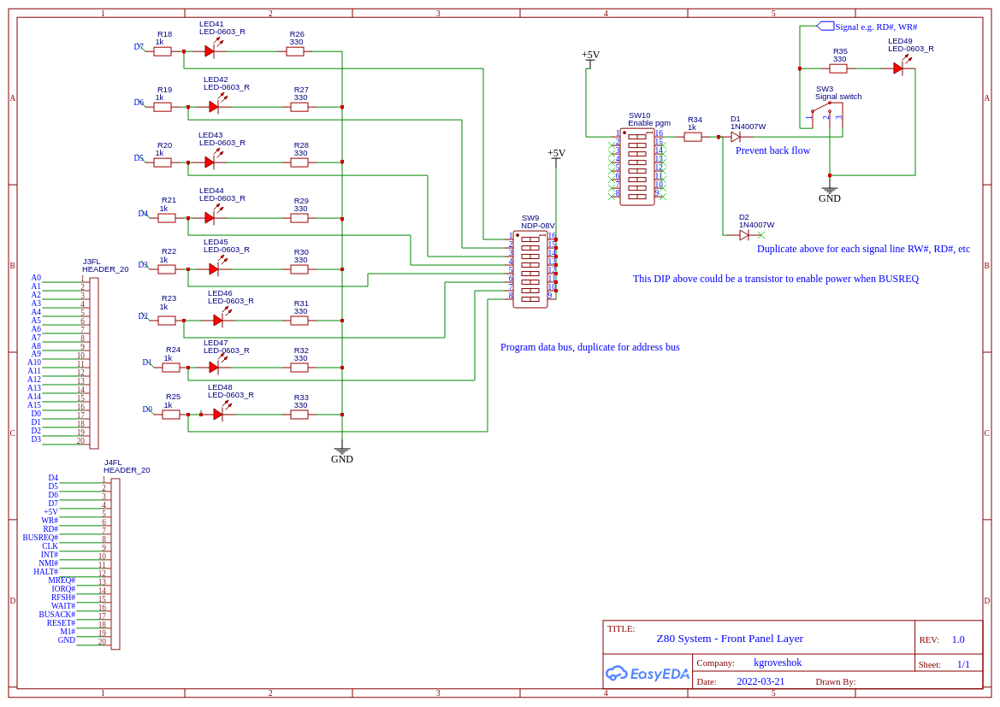
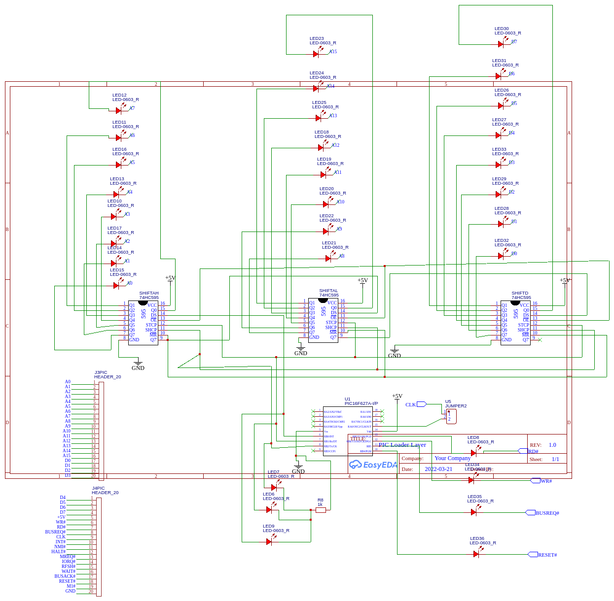
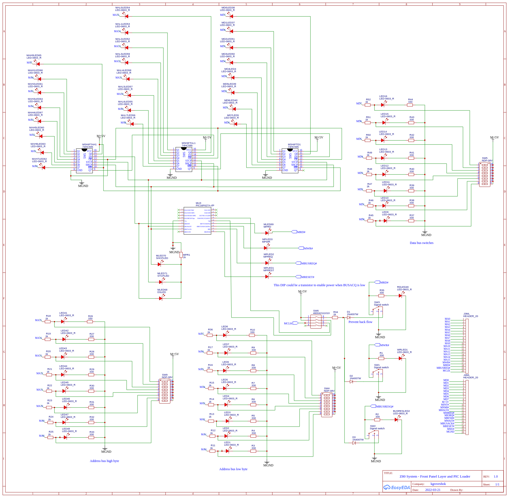
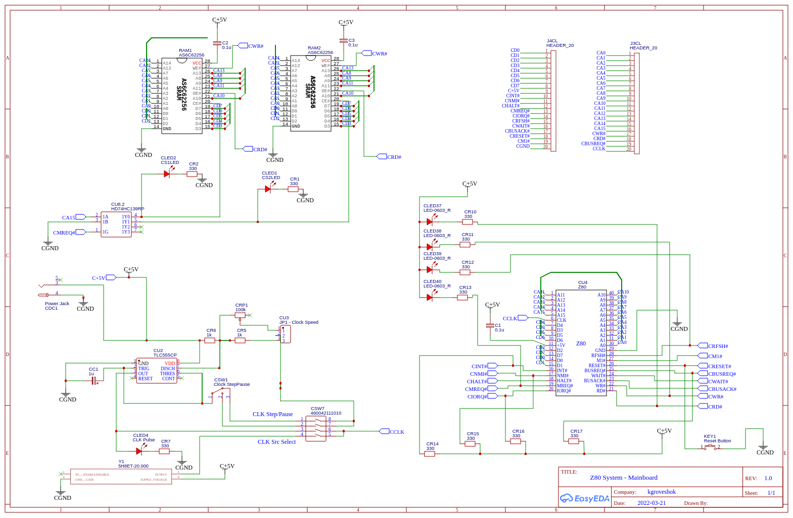
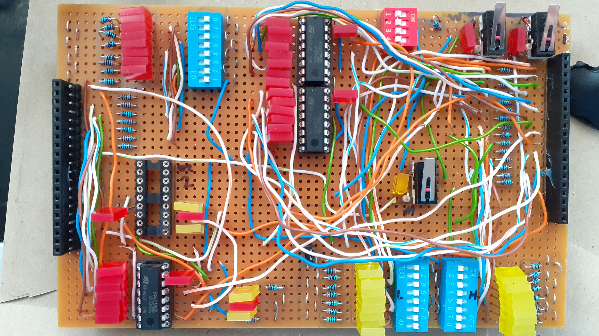

# z80-homebrew
Z80 Home Brew Micro-computer Project - Dev Diary
------------------------------------------------

Stage 1.0 DONE
--------------

Create a basic breadboard circuit with CPU, clock (for now 555 so I can watch it do things) and RAM.

The CPU is executing whatever random code is in the RAM at start up. Looks pretty with the flashing lights.

See this stage at []

Stage 1.5 DONE
--------------

Resolve the issue I have in manual bit bashing machine code into RAM.

Now fixed in []

Stage 2.0 DONE
--------------

Now I have the sequence to program RAM by hand, speed it. Because I don't have an (E)EPROM 
and programmer I will put a PIC to act as a bootstrap loader at Z80 startup and bit bash a simple 
monitor program into RAM which I can then use to load further code.

First part will be to load the same simple program as used in the the Stage 1.5 test. Once that
electronics is working I can then write larger programs to boot strap which will be where Stage 3.0 
comes in...

Testing shift register... []

Testing shift reg sequence []

Ready to boot strap! []

Another go which does'nt quite work... []... Turns out 
that powering down mid shift register loading fixes it. Will do a better fix with the 
coding on the PIC :-)

Stage 2.5 (DONE)
---------------

The breadboard is becoming quite full, and with the next stage focusing on RS232 where timing is 
important, I think it might be a good idea to finish off the low speed parts first, then
moving as much as I can off of the breadboard to strip board for the space and more stable 
circuit at speed.

In this stage then I want to perhaps add a second 32k RAM chip as the high address bit wire is
currently unconnected. That will then provide a full 64k RAM, as well as the prospect that I
could swap out either RAM and replace with a ROM further down the line. 

I will also obviously add a couple of NAND gates to switch between them. I may also future
proof the setup and consider tapping another address line and splitting the top half into 
smaller sections so that I can slip in external device memory maps. That will depend on the
requirements for the DART, SIO, PIO chips next. Of course moving to strip board using the
stacking method I'm considering means that if I need to change page addressing, I will only
need to swap out the card(s) affected and not the whole board. Bonus!

To do this I *REALLY* need to document the board! :-) I will be using maybe Eagle or easyEDA for 
the main schematic and then ancient VeeCAD for the strip board layout.

Here we go, first draft. Not pretty as a number of things I need to clean up and be consistent
about. But you should get the gist of it I hope. Also as far as the address decoder I don't have
the chip that I found would make life easier so I may just sling in a PIC (yeah I know over kill)
which can be adjusted in light of any requirements for the next stage. In the end I will of
course replace with a fixed device when I know what is going on. This is a work in progress
after all and not a finished project!

PDF versions can be found in the stage2.0 directory too.

Stage 2.5 (DONE)
----------------

Well that week was painful. Have to say easyEDA is not ideal for doing strip board layouts, lack of 
random wire routing prevented all the traces being laid. So in the diagrams any feint blue lines
and red ones are wires that need to be routed over the board surface. Horizontal blue lines are stripboard
tracks. Also some passives (resistors and caps), all LEDs and three diodes take up a lot of room and in 
this easyEDA don't allow for adjusting the leg positions which really helps with stripboard
so some of them on the board layout are 'floating' with I hope some clue about where the should go
if you adjust the legs. The white blocks are track cuts. All looking from front side of the board.

I would say that the board layout gives approx position for the bits and some of the key connections.
This should be enough to help wire it up. 

The multilayer idea has been scalled back a bit to keep part costs down as board and more so the
header strips are a little expensive for some reason:

Hopefully will begin assembly soon. I will take loads of pictures of my protoytype too as
that will help in checking my wiring.

NOTE: After I began to solder things up I noticed a number of problems on the board. I've 
updated the details above on this schematic:

Most important is it won't all fit so have had to move things around a little. 
Another is that a front panel switch previously said MBUSREQ# but that should actually 
go to MREQ#.

Further problems were also found in less than ideal arrangement of pin outs for the PIC.
I've therefore rearranged the allocation and this will affect the coding of the PIC.

Shift Reg DS now on PIC pin 7, SHCP on PIC pin 12 and SPCP on PIC pin 11. PIC pin 6 is now MREQ#,
PIC pin 12 now RESET#, PIC pin 13 now BUSREQ# and PIC pin 10 is WR#. That resulted in one spare LED
and no LED for the DS pulse.

I would then advise not following my stripboard layout and use it as a guide as to rough locations.
The switches in the top right were way too tight and coupled with my poor soldering skills 
(improving after all this though) it forced me to relocate one to the middle of the board which is now
the MREQ#.

Photos of construction below of the front panel without the PIC as that was being reflashed with 
changes for the new pin layout:
 

The red four switch DIP switch has so far two features active:

* 1 - Enables power to the switches when in front panel programming mode - I could really do with
replacing the manual switch with a transitior which activates the power when the BUSACK# line goes
low. 

* 2 - Powers on/off the PIC

* 3 - Not yet connected, enables direction of the PIC clock to the CLK pin as yet another clock source.

* 4 - Not connected.

Next will be the main CPU construction now I know the front panel is working as that is
the most complex of the wiring - really tested my soldering skills!

More mess.... Halfway wiring up the main board discovered I've made some mistakes in the
reverse engineering of my bread board prototype. Going to have to redraw and work out
how to get around my mistakes with what I've already wired. Drat.

Updated main board with the fixes for the wrong LED taps etc:

Both boards now built, however there is a slight bug in the main board. I suspect I have either
missed a track cut or put a wire in the wrong hole. I will have to track that down I suppose!

There still appears to be a problem. The BUSACK LED is still flashing, in fact many of the other
LEDs are flashing in sync with the clock. I suspect something either power related, or there is
a problem still with BUSREQ line and a constant on and off of BUSREQ. I can't see any solder 
bridges and continuty of the lines work out right. 

What I think I will do and this is very annoying is to redesign for a less dense set of boards,
just have say CPU is on one board, clock on another, memory on another. That way I can break
down the issue and hopefully reduce the amount of interference across tracks.

....

I've now rebuilt the clock and CPU boards. Having tested them against the breadboard prototype
and the initial stripboard all appears fine. Perhaps I didn't have a problem???

Anyway now continuing with the memory board build and will then check that. 

Here is a side-by-side setup of the two new smaller boards stacked (timer on the bottom and CPU
on top), along with the very definately working original 'front panel' board so I can watch 
the address lines ticking up the PC location and proving things are working.

Been pretty delayed lately but finished off the memory board:

Have discovered the problem with this new board. The BUSREQ# line is floating and/or not tied right (perhaps even got this pin and BUSAQ# confused) which is causing the CPU to give up the bus and then recover - hence the flashing.

And at long last we are almost  back on track. Fixed a couple of odd hardware bugs. Mainly because I soldered wires in wrong holes. Grrr. Because I also feel that the front panel of the original
might be a bit suspect (although I've not tried it since I fixed the board) I knocked up a quick stripboard with LEDs on the data and address lines to make sure things are working. In the 
photos below you can see this board sat on top of the board stack which has the clock and power on the bottom, the CPU on the 2nd layer, memory on the 3rd.

Now, if I'm no longer using the original front panel which has the PIC memory bit basher loader on it, I then need to build a new PIC board. In the picture below the new PIC
test circuit is being constructed to the left of the Z80 stack.

Once I finished the PIC loader I will be in a position to move to stage 3.0....

#2023-07-11# 

Been a while since I've touched this. Had to tear most of it apart to try and remember what is broken. Turns out clock and CPU board are possibly OK.
Memory board may have some address line dry joints. Have been looking at using real RAM but with lack of an EEPROM programmer for ROM I've looked
around for Ardiuno Mega programmers. Mixed results for some reason. Intermittent data loss or error writing and reading. Then I've had a try with
battery backed RAM to help and that seems to hold charge OK. 

Found another Z80 simple system using the SIO so had a look along with a Mega simulated RAM/ROM, hacked that about a bit to do extra stuff and happy
that what I'm doing is viable. Though Mega clock speed is well below the min clock speed for the SIO testing to remote terminal so need to get
the RAM loaded with a monitor code that may or may not work and try it at full speed. 

Lacking so many bits for this....

Stage 3.0 (DONE)
----------------

Jan 2024

Been many months since I last looked at this mainly because of issues with bit bashing the RAM, and I have since located an EEPROM device. July 2023 I created the circuit and PCB in the stage3.0 dir and Jan 2024 got around to testing it (28/Jan/2024).

After discovering a few soldering issues I'm not up to the point of the Mega being able to test the CPU stepping through and using simulated RAM/ROM as well as checking that the address decocoder can select the various devices and memory banks:

	Device A - out (001h), a
	Device B SIO - out (040h), a
	Device C - out (080h), a
	Device D - out (0C0h), a

Next step is to attach RAM, ROM, and SIO and write some code to control the SIO with real clock speeds (will need to attach the scope to monitor 

...

Found PulseView and https://github.com/dotcypress/ula via the Rasp Pico can give me 16bit bus. Also has op code decoding of the data bus which is handy. Though had to compile from code due to a bug in USB devices that surfaces after 5.11 kernel. Odd but it eventually worked and saved me upgrading my four probe Saleae to 16, or getting more than one as I could just throw another Pico at it and get them to trigger from the same pin.

Did show that while RD and M1 and some address pins are broadcasting data, nothing is appearing on the data bus. 

Checked solder of pins on the ROM. Happy that the signals are leaving the CPU as they appear on the bus connector. Do they reach the ROM? Yes all pins between sockets and the bus I'm tapping into reach

Check continutity of address and data pins between Z80 and ROM socket. Yes, ditto.

But.... Caps appear to not supply power which is odd considering they are the same as the CPU. Bypassing them and I now see signals on the data bus. How odd.

While I work out why the caps are a problem I now need to make sure the CPU is actually executing the ROM correctly...

...

Don't think I can trust the scope reading the data bus. So I wrote a bit of code that reads and writes to the high memory bank and with lots of NOP and a slow clock it is possible to watch it run and flash the high bank LED during those operations. To make sure it is not random code then added a count down loop followed by a HALT. The code on multiple runs functions the same way each time. I would count that as a success and proves the CPU is running code realisbly.

And here is the code  running 

We have a functioning CPU, ROM and RAM.

That I think then marks the end of testing the PCB functions other than getting the SIO working, which I know at this CPU clock cycle of approx 14HZ won't be fast enough for serial comms to work. 

I will instead look at adding an LCD screen to get some kind of proof more extensive code works, then maybe add a keyboard matix for scanning. Then go from there.

Let's draw a line under this stage of proof.

Happy now!

Stage 3.1 (DONE)
----------------

Feb 2024

LCD and keyboard matrix...

Taking the design from the wonderful Stephen Cousins website  I was able to hack
his code about to fit my assembler and some of my support code to produce a result. That validates the code and new PIO circuit and gives me something
to adjust for my own needs that I know works. LCD now working. Keyboard next.

Basic keyboard via port B mapping of the two nibbles on the port to a 4 x 4 matrix keyboard is working. Have a slight problem with column axis if more than
one button is pressed at once which is odd as the rows are individually emergised. Might be a short or a coding issue. Had to tie the columns to a resistor 
to ground to prevent floating phantom inputs. (Diagram to follow)

At least single key presses work and should be enough to get a basic keyboard working although cumbersome to use. 

Next will be to focus on a set of firmware with utility functinos to support keyboard and screen. After that can then look at external storage.

Stage 3.2 (NOW)
----------------

Firmware and utility functions: Keyboard, Screen and Storage

Need a video memory area for reading and writing video updates to save on having to keep reading and writing the screen. Or do I? I have a spare line on port A
I could use for read enable of the LCD??? Would that require some strange control stuff? Otherwise easier to use a screen frame buffer to write out.

Also need screen functions for:

* TODO Scroll up and down
* TODO Scroll left and right
* Clear screen
* Position cursor
* Write string
* Read char at pos (using frame buffer so direct memory access)
* Draw cursor
* TODO Can I use control chars to set attributes such as inverse? Might need double byte buffer or certain bits to generate from frame bufffer
* Multiple framebuffers for window layers and function to switch active frame buffer

Keyboard functions:

* Scan keyboard in raw
* Key scan to char conversion
* Abstract away the keyboard configuration to enable different keyboard layouts (e.g. mobile phone style vs full ascii keyboard)
* Key debounce
* Repeat key timer (No repeat)
* Control key functions
* Prompt box with keyboard state indicators

    1       2       3       A
    abc     def     ghi     bs
    ![]     “-      £+	

    4       5       6       B
    jkl	    mno     pqr     break
    $=\     %{}     @#^	

    7       8       9      C
    stu     vwx     yz	
     &:;    *,/     ().?	

    *       0       #      D
    symbol  space   shift  enter

... 

Wired up CF card using schemtics from the wonderful work my Steven Cousins, however card timeouts. Not sure if card, electrical or software releated. Will bake that circuit to the new
PCB anyway and hope for the best

What I have got working at least in prototype using a Pico is SPI read and write to a Microchip Serial EEPROM. If I use the smaller 64k versions I can keep the code simple enough
to provide 320Kb onboard storage and 512Kb cartridge on the PIO port B interface. That works for me and is easier to scale up to using the larger chips just by changing the code
to clock out the additional address data.

Also I have a SPI interface I can use for other stuff too. Could use for a larger screen perhaps? That is possible I suppose. Nice.
If I use say page 0 of the storage array for BIOS data I could have bit switches to enable and disable hardware such as which keyboard to use and if using different
display features etc.

Will now port the Pico python code over to Z80 asm and make sure the SPI is working with some test commands on the CLI. If that works then can update the schemetics and 
fabricate a new PCB for version 4. 

Stage 3.3 TODO
----------------

Storage. CF or could I make use of the stack of serial eeproms I bought for a data logger? A CF would be storage overkill but the serial EEPROMS are small and easy to daisy chain for unlimited storage. Could try that. 

Stage 3.4 TODO
--------------

Power. Could I add battery support so it is portable? Recharge circuit I would need to add though could pull that in from a Pi battery charger.

Or would normal battery packs work long enough to make it worth while? 

Stage 3.5 TODO
--------------

Code a basic core part of an OS which uses the screen, keyboard and storage. A super monitor program. From there could then add
Forth which could provide the drivers for add on hardware.

If the OS has a 'boot' buffer say in the first 'block' of the storage that could bring up the rest of the hardware etc.
Would make adding more hardware easy rather than coding in asm.

Stage 4.0 TODO
--------------

Redesign PCB with LCD, keyboard and storage onboard, add edge connectors etc and produce a 3d printed case.

Good to go then.

Extra TODO notes
----------------

A - PIO? Spare???? -> Trigger for next batch of decoding???
B - SIO
C - Keyboard
D - LCD

Extending the address decoding to cover more devices would be good.
* DART
* Keyboard
* Video
* Sound
* Network
* RTC
* I2C
* Canbus???
* As many spare as possible

Memory Map
----------
First 32k - ROM
Device ports
Monitor
Forth OS?

Second 32k - RAM
Program area
Screen Memory? 20 x 40 chars
Stack
Intel monitor input buffer
Vars

Rig up the Z80 DART, SIO or PIO chip to add RS232 support and then program the the boot loader 
with a monitor program and remote program load function. Perhaps too expose some I/O interface
so I can have some future expansion/control features like a Pi.

At this stage I will have serial terminal working and would therefore be a functional computer to
some extent.

Thinking about features for the boot loader/monitor that the PIC will bitbash into RAM:

* Hex dump memory to check things have loaded OK
* Change memory locations to manually load data or fix something if needed
* Set program counter and run 
* XModem/ASCII load of a hex file, or perhaps better still just raw binary load direct into memory
* May be add the monitor to NMI to break into control should things be broken
* Configure various properties of the system and have them saved to PIC flash??? Can't really though
  as the pic pins are one way so essentially it can't be seen by the Z80. This was a design choice.
* When SD or CF card support is added then have some control over loading/saving etc
* Have decided that the monitor will actually function as the main 'OS' simliar to the BASIC's of old
  and it will be a Forth implentation so I can have a good compact and simple language at hand for
  programming and hardware control.

Add some external interfaces to make it do other things would be useful. Perhaps even to drive a
small LCD screen like those old Sharp handhend computers I remember. Would also need to add keypad
support of somekind which then makes it a self contained computer. Would be cool if I can then 
place in a suitable case and have battery support.

I know not quite retro enough but a small Rpi that can grab bus and read from 
a screen memory mapped area and sling out on HDMI? Obivously would be nice
to replace with a proper composite out if I ever get that but that is
stretching my skills and have no knowledge (yet) of that tech.

