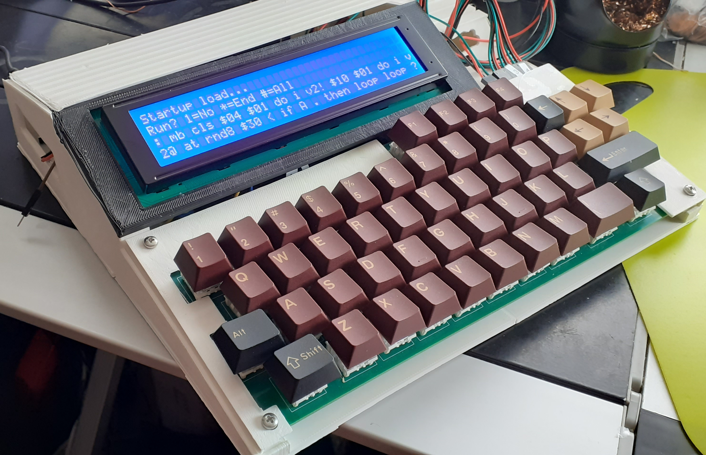
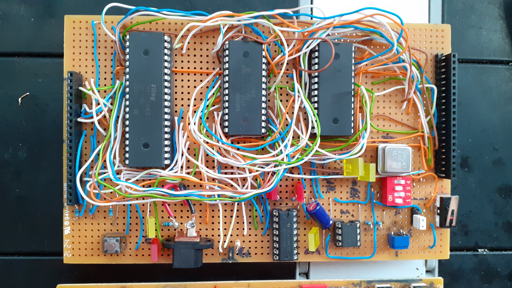
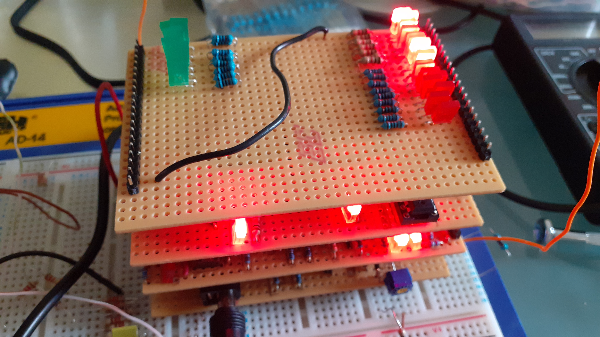
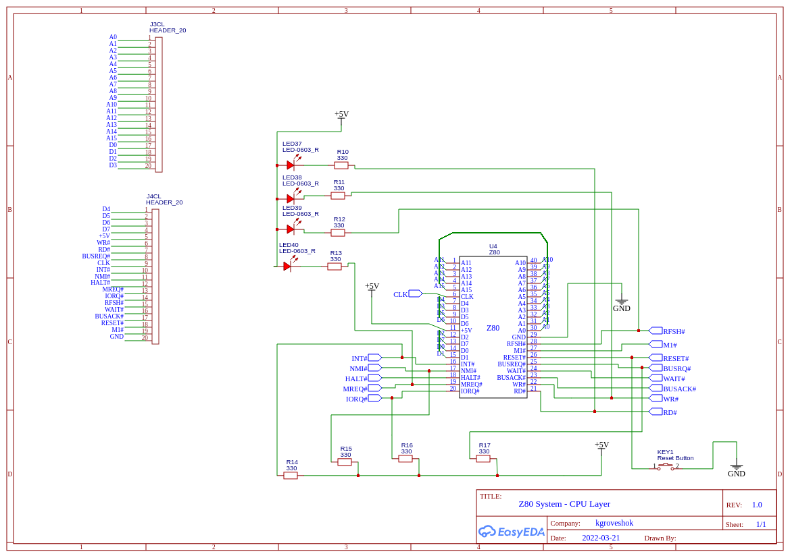
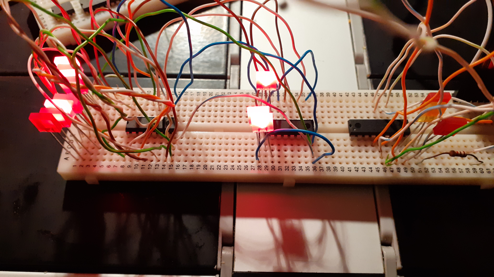

# z80-homebrew
Z80 Home Brew Micro-computer Project - Dev Diary
------------------------------------------------

30th July 2025
--------------

* DONE Tidy auto run loading screen
* DONE Add ACTTVE word which returns the next in a cycle of progress
* DONE Make monitor do a call warm boot. Does it already do this during stack crash or a different case? No add it.

* TODO New Uptr word to point to start of exec code of uword. Handy for writing forth hook code.
* TODO Add hook vectors. Can change  dbug checks to vector with return if disabled to save on push and asterisk checks. Add hook for stack checks to disable. Add hooks for some other points such as before and after words

* TODO NMI vector and switch - default to running monitor

* TODO Monitor to have G command
* TODO Monitor to have warm boot jump option
* TODO Add to symbol some key vectors for commands eg. MALLOC, PUTCH, GETCH, Symbol table. 

* TODO ed word has a rouge address pushed to stack when editing a record

* TODO Add op-amp circuit to SPISound and allow for selection at wire time

* TODO Save auto run flags to block 0 on bank 1 and not on currently selected device. Need a function to load from block 0 into hardware_config and then repoint all menu options to load and save them.

* TODO Add a flag to block 0 to decide if the auto startup prompt is given and/or run
* TODO config var to auto run everything?
* TODO Add selectable guard around SPIO to prevent accidental corruption of storage banks
* TODO BUG Add reselection of BANK during auto load 
* TODO need words to report on hardware e.g. screen dims

* TODO Add command to select between common or node PicoSPINet storage banks
* TODO Add command to select different banks of common or node PicoSPINet storage banks
* TODO BUG Uword can't have a numeric in the word name???? Odd...
* TO TEST need word to report where cursor current at
* TODO BUG swap of string and number leaves string ptr being left as number. Not swapping var type?

* TODO Add word to call fill_display with a char
* TODO Add FILL word - ( addr n char -- ) fills address for n long with char
* TODO Add ERASE word - ( addr n -- ) fills address for n long with zero
* TODO LSHIFT and RSHIFT for bit shifting
* TODO in dla handle empty dir
* TODO Word to define lcd user character 0-3. Then word to output via emit etc

* TODO Fix NUM2STR. 
* TODO Fix LEFT
* TODO Fix RIGHT
* TODO Fix 2SWAP
* TODO Fix KEY
* TODO Fix IS 
* TODO Add to start up a list of what storage labels are seen

* TODO Add LREAD support to the autostart exec

* TODO Handle socket level iputchr
* TODO Handle socket level igetchr

* TODO Combine VAR and SCRATCH?
* TODO Add word for setting node number to talk to???

* TODO SPI Net send internet traffic and push results to message buffer. Does get URL but blows out on memory
* TODO SPI Net get LAN status

* TODO Future bug? stack imbalance on storage_read. Needs a pop of de if no record found. Have added code watch for further issues

* TODO Stop menu scrolling past last item
* TODO BUG If : word is in caps it wont work. This could be connected with caps on LIST which only works if given as lcase.

* TODO add more editing features 
* TODO fix editor bugs
* TODO fix editor issues
* TODO typing a long few lines and then back space, then insert ends up creating spurious characters - added clear of edit buffer
* TODO PICK word to pick a value at a given value on stack and move to TOS
* TODO Fix prev line recall and insertion. Corruption appears on the end of line - added clear of edit buffer
* TODO Editor issue insert mid string causes loss of zero term giving random data
* TODO Backspace mid string does not clean up shifted text
* TODO Jump to end of line does not work should set to the number in last debug display
* TODO If cursor at end of line, when go back it leaves custor displayed
* TODO With the float code being so big need to do some opt via http://z80-heaven.wikidot.com/optimization

* TODO read ext concat is the problem
* TODO uword not exact match pulls wrong code
* TODO file select to auto run
* TODO file select to view
* TODO file select to copy to del
* TODO rename file
* TODO delete record
* TODO ui to call config
* TODO backup and restore of banks to network
* TODO change size to fsize?
* TODO do random quotes from file as example code
* TODO ui join files ui
* TODO add file description

Nice to haves:

* TODO Conslidate all prompts into a single file to allow for removing duplicates and may even localisation
* TODO Add scroll down indicator to menu code
* TODO Cant use special chars in quoted strings??? Why? Emit works for the char code.
* TODO Saved setting to enable/disable auto start
* TODO Saved setting to select words to auto load from storage
* TODO add ram test to the diags
* TODO Alt T is duplicated }. Free to reuse
* TODO Alt H is duplicated |. Free to reuse
* TODO Alt U, O, P, 5, 7, 8, 9, Enter are free
* TODO for auto run storage include a CHAIN feature
* TODO Do a nice FORTH primer with the hardware. Screen shots and all...
* TODO New case design - Have a new one, printed and need to refine for use with PicoNET
* TODO Add to docs that looking up file name of id is just id BREAD 
* TODO Create a disk UI in native asm for robustness and speed? Have some config routines for this now. Expand on them
* TODO New value type for signed and unsigned val. Add to maths. added DS_TYPE_SNUM need a word to convert type. SIGN/UNSIGN. Fix up <= and dot.
* TODO Speed up screen updates - instead of writing whole screen detect what has changed? 
* TODO Add no bank chip detection to format
* TODO Add support for ELSE and ENDIF. IF THEN ELSE ENDIF   or IF THEN ENDIF. Or IF ... ELSE ... THEN

* TODO need word to get file id by name
* TODO need word to get file name by id

* TODO setup a compiler
* TODO Add a stack content viewer to callmonitor code
* TODO Add the floating point maths code in
* TODO CP/M screen clearing not working well
* TODO CP/M keyboard entry not great
* TODO Change circuit so that the storage cart is actually on port a and provides a full 5 chip pack. Then move sound to port b
* TODO wire up a temp interface to the serial EEPROMS so I can test storage on the SC114 as I have the PIO and digital IO cards installed
* TODO Take the vid out handshake lines and code up a Pico to handle display.
* TODO Pico to handle display to have two way return of data
* TODO Due to bad performance of the parser (???) need to look at compiler... Added some OP code stubs. FORGET and LIST use a scanner. Combine with main parser and have one for keyword and another for byte code
* TODO Add a simple assembler feature like BBC Basic

29th July 2025
--------------

* DONE RENAME word to allow for the new auto start method
* DONE Change auto from file to run all files with asterisk in first chat of name
* DONE BUG now forced to resolve the lread feature when loading from file

28th July 2025
--------------

* DONE SPISound now built and working as a temp board. Still need to do PCB 
* DONE Not doing. Change NOTE to PLAY and use a stream of items on stack
* DONE Via SPI with the second PIO port hook up and debug the sound card
* DONE Create A SYMBOL word which is a look up to the address of a system symbol table more efficent than adding more words
* DONE Fixed SPACES
* DONE bl word causing reboot only on z80, not doing it in cpm. Maybe due to write to ROM on z80.
* DONE FILEADDR already does this. Add word to report the physical address of the currently loaded record
* DONE Added a direct memory edit DEDIT word
* DONE file editor

7th July 2025
-------------

* DONE Added emulation of EEPROM storage to PicoSPINet. A single common bank testing with

3rd July 2025
-------------
* DONE Fixed -> adding extra spaces. Push/pop of wrong reg pair

29th June 2025
--------------

* DONE Added VAR word to handle 26 letter var array
* DONE Added SPITIME const to provide a better way to handle SPI timing changes
* DONE Add word for setting spi_time

18th June 2025
--------------

* DONE PicoNet - Basic multiplexing of SPI nodes with echo back interface working
* DONE fix listen command to clock a char out from buffer. 
* DONE Once clock out char is working then can do the rest of the commands

* DONE SPI Net NTP time support. Sets NTP time. Need to get it back
* DONE SPI Net get waiting messages for node from server. Seem to have a clock out issue. SPII always gives zero. Need to use scope.

24rd April 2025
---------------

* DONE new multiplex code for SPI Net gateway can now multiplex in a command and params for the put char to buffer. 

2nd April 2025
--------------

Just been building a second machine to provide a way to test the Pico networking and found I hadn't documented the hook up of the LCD and keyboard properly. So here it is:

# cld1 follows 20x2 lcd pin out
# 40x4 lcd pin to lcd connector
#
# lcd1 header
# 1 gnd
# 2 +5v vcc
# 3 vo
# 4 rs
# 5 r/w
# 6 e
# 7 nc
# 8 nc
# 9 nc
# 10 nc
# 11 d4   pa4
# 12 d5   pa 5
# 13 d6   pa 6
# 14 d7   pa 7
# 15 back light   need link to +5v
# 16 gnd

# where does e2 connect?

# lcd 40x4 con
# 
# 1 db7
# 2 db6
# 3 db5
# 4 db4
# 5 db 3
# 6 db2
# 7 dv1
# 8 db0
# 9 e1
# 10 rw
# 11 rs
# 12 vo
# 13 vss
# 14 vdd
# 15 e2
# 16 nc/vee
# 17 a
# 18 k

Keyboard PCB hook up is reversed!

Main PCB:     4 3 2 1
Key PCB:  + - 1 2 3 4

40x4 LCD hook up

Looking to rear of LCD socket pins labelled to main board connector

  +--+--+  
 2 |13|14|  1
 4 |11|12|  3
 6 |  |  |  5
 8 |  |  |  7
10 | 5| 6|  9
12 | 3| 4| 11
14 | 2| 1| 13
16 |  | x| 15
18 |16|15| 17
   +--+--+

x - VIDCLK pin on VIDOUT connector:

    ^ to back of board
    GND
    +5
    VIDCLK
    VOUT

 

21st Mar 2025
------------

* DONE CART not setting correct CE lines as shown by tests with picospinet.py. Helps if you use the correct word CARTDEV not CART
* DONE BUG Init of SPI is leaving both bank 1 and cart 1 CE active. Need to do $01 BANK first to set flags correctly. Fix to disable cart 1 CE at init. Yes, in storage_init there was a set 0 on CE which should be high not low
* DONE When switching between BANK and CARTDEV change the spi_clktime between 0 for BANK and default to $0a for CARTDEV
* DONE Hook up Pico and get it talking over SPI to enable networking. If using SPI + CE then can have Pico being hub for a few z80 machines to network together. CE is working now but clock isnt handshaking correctly. Each SPIO seems to send a single bit... Now have some basic SPI node activity working.
* DONE SPI Net Wifi config via Z80
* DONE SPI Net sending messages to nodes and server to batch delivery

23rd Feb 2025
-------------

* DONE Crash on READ past EOF
* DONE Add some constants such as current file open id and file ext that can be used for better data manipluation
* DONE As READ is now only loading one block in at a time, will need to look at the auto code load and have that concat long lines together. Added LREAD to autostart.
* DONE added access to the current block READ so can use with BUPD

9th Feb 2025
------------

* DONE BUG If a non-existing file extent/id is given as param to ERA, APPEND etc then the storage appears to be reformatted!
* DONE BUG If an unknown uword is given for LIST then the system reboots
* DONE add info page word. INFO word.
* DONE ERA is causing a reformat even for valid id. Now fine
* DONE Add high level RECORD word that allows loading of a specific file extent from storage
* DONE Added GETID to get the file id by name
* DONE reduce some of the stack sizes, loops and ret might be a bit too big. Then extend the main data stack
* DONE fix saving more than a single block of file storage. Means to concate multiple blocks? Append is creating more blocks. But is it writing correctly? READ is picking up extra blocks but second block is corrupted. Is READ or APPEND broken? APPEND might be OK. So check READ. It is READ that is broken. Have decided to leave READ as by block, with user deciding if it is worth CONCAT records together.

5th Feb 2025
------------

* DONE Added a low level menu function and moved diags around so that it will be possible to configure settings via storage
* DONE Rework diag menu to be config which loads persissent settings from block 0
* DONE Alternative to EXEC/STKEXEC is a word that presents a menu of uwords to save or load on storage. CONFIG is the word
* DONE Need that MENU word done then! Low level word done, add to user words using scratch buffer to setup ptrs to strings. max 127 menu items
* DONE FIle system words not working. FORMAT, BREAD, BUPD work. But not CREATE, DIR and LABEL. Then check APPEND manually Why? CREATE, APPEND and READ are OK. LABEL is OK. DIR is not working. A push to string to stack fault
* DONE overlap os_new_malloc=os_input
* DONE f_cursor_ptr=store_tmpext
* DONE spi_device_id=store_tmpid
* DONE spi_device=store_tmp3
* DONE spi_cartdev2=store_tmp2
* DONE store_tmp1=store_tmppageid
* DONE store_filecache=store_page
* DONE It appears the config dir scan is corrupting the spi_device byte and poking f5 into it every time. Corruption where? Not normal DIR. Must be in the config code. store_tempid=spi_device_id, store_tmpext=f_cursor_ptr and store_tmp3=spi_device, store_tmp1=storetmppageid. got location overlaps. double check all of the symbols as a few more overlaps.
* DONE Saved setting to enable/disable auto load of words from block 0 as part of auto start
* DONE Add a flag to block 0 to include the bank id to exec at startup
* DONE Add a flag to block 0 to include the file id to exec at startup
* DONE Add auto run of selected file. Prompt and running load but crashes on 'ret'. Even if moved before main autoload still crashes. Got it. storage_read fail has something on stack
* DONE EXEC and STKEXEC not evaluating???? is COLN def non re-entrant? does it care about existing setups? EXEC is OK but STKEXEC not working?  Stack appears messed up. Where is it going wrong?
* DONE Can't use EXEC in code so need another way to trigger stack eval. Make EXEC to take a count of strings?

3rd Feb 2025
------------
* DONE SWAP was flagged as done but it wasnt
* DONE Add a print using ptr on stack: TYPE ( addr c - ). Replaced with a uword in auto start.
* DONE Add better handling of empty stack. Stop execution and return to prompt? Yes jump to cli and not warmstart
* DONE Clear stack word? Make a uword for it if needed??
* DONE Add ALLOT to be same as malloc
* DONE Go through all word code and set key debug spots 
* DONE FORGET might be broken
* DONE WAITK on cpm fails 
* DONE KEY on cpm waits for key press - KEY change below??
* DONE fix loading more than a single block of file storage via BREAD
* DONE BUG Any push following the use of BREAD results in a malloc error... Retest. Or this could mean string longer >64bytes to go to multiple blocks
* DONE Rework the storage system file structure and functions. Remove some of the defunct words.
* DONE have a word to set break point at a DMARKer. Not doing
* DONE KEY was waiting on hardware but changed from cin_wait to cin
* DONE back slash not working on hardware. Alt space. Escaped backslash was there but switched it for dec 92. Apparently 92 is a Yen on the LCD so not possible

31st Jan 2025
-------------

* DONE Test CALL
* DONE Relook at variable use. Setup a VARIABLE word which puts the address on the stack and allows the ! and @ words to access them. Now with SCRATCH to emulate via uwords
* DONE my malloc is failing on free. Not doing as the other malloc is fine.
* DONE Rewrite push code to see if that removes the crashing issue
* DONE Added stack checkpoint macros
* DONE EXEC causes crash. Narrowing down crash point. RSP issue. OK might be a recursive issue.

27th Jan 2025
-------------

* DONE Up arrow to recall last command not working
* DONE FORMAT word
* DONE CREATE word
* DONE LABEL word
* DONE APPEND word
* DONE OPEN word
* DONE READ word any further push of a string (numbers are fine) to stack causes a crash after first use. Appears to be the malloc failing. Using my malloc it works.
* DONE EOF word
* DONE ERA word
* DONE FFREE word
* DONE SIZE word
* DONE Enforce malloc free
* DONE Add direct storage words (BREAD/BWRITE) so I can use soft coded file system ie screen like storage without using the possble flakey file system.
* DONE Added push and pop hl into FORTH_DSP_POP so can remove those from all calls. Will save a few bytes
* DONE Do I have a +! which is increment a memory location by prev item on stack? Handy for the new variable use. Added along with -! for decrement

26th Jan 2025
-------------

* Added NOT word
* Fixed SCROLL display corruption
* Added user word LIST to demo scroll
* Adding vert scroller demo game

24th Jan 2025
-------------

* Start a bit on the sound work
* Work on a small new game 

15th Jan 2025
-------------

* DONE fixed a minor storage error
* DONE create stub of forthcompile in the parser file 

13th Jan 2025
-------------

DONE Add CP/M support to speed up dev even more as could see if RunCPM works so wont actually need any hardware!

12th Jan 2025
-------------

DONE Fix COPY. Now using DUP with type check

10th Jan 2025
-------------

DONE Fix UPPER
DONE Fix LOWER
DONE Fix TCASE
DONE Fix CONCAT
DONE Fix FIND
DONE Remove the need for WORDS as only UWORDS is really useful
DONE Fix scroll words
DONE NOT DOING. CLI input on SC114 is running high refresh. Not using key wait? Because on hardware it handles cursor flash

6th Jan 2025
------------

On SC114 things are much more stable than the original hardware. I've not soldered the power caps. Could that be the reason? Or 
perhaps some bad joints?

Anyway finish off the remaining words and bugs seeing the SC114 platform is faster to turn around an image load rather
than having to program an EEPROM. Of course can test hardware parts like storage. At the moment... 

DONE Add keyboard macro defs on function keys - need them as tokens in the dictionary for easy recall - add as user defs?
DONE  cleanup/free not being done. Is that a problem? Use DSPPOPFREE. Seems to be OK in some situations but with SW it crashes straight away that is using my malloc. Switched back to DK88 and free is working so use this one for now and note bug.
DONE ???? TODO The word THEN appears to be having issues and is being pushed to stack GA is failing too. Suddenly working. Maybe a mem glitch
DONE write a simple screen saver demo to test for runtime crashes
DONE ?DUP word to duplicate if the TOS value is non-zero

1st Jan 2025
------------

DONE change data stack. Each push will be three bytes. First byte is type. If num then num in next two byts, if string then pointer. That will save on mallocs. Other data types will make use of the pointer
DONE Switched back to my malloc for now
MAYBE TODO New malloc that only ever adds to memory with a simple forward pointer
DONE. Fault in STR2NUM word. BUG 'ga' word has an issue with detecting the random number. Is it the logic checks?
DONE At boot detect if key is held for debug, add another key for hardware diags like checking keyboard etc
DONE Add a dot comment to forward the next print position use .>   
DONE have a flag to enable forward cursor from each . or .-
DONE word which allows edit of item on tos - word added but does not copy from stack
DONE words for GPIO access. Stubs created
DONE Sort out the EXEC word so that I can create a simple save and load of UWORDS

PART DONE break out parser so it can be used by LIST, FORGET, WORDS, UWORDS and SAVE 
ACTIVE Do I want to do tokenisation of the keywords next to see if that speeds things up???

31st Dec 2024
-------------

* Now fully working on the SC114. 
* Have removed initial level of malloc calls. 
* Switched to the original malloc function which should be a lot better than mine as it has garbage collection.
* Tested run with and without debug code and 'SW' runs 0.4s faster without debug code included.

27th Dec 2024
-------------

Reviewing code. Objectives for this round of dev is to:
1. Make sure existing code runs on the SC114 so I can easily test
2. Remove mallocs which is slowing the code down
3. Run a tokenisation of the keywords to single bytes which will also vastly speed up the runtime

27th Nov 
--------

Still have memory issues and certainly performance issues I think due to the extensive memcpy and tokenisation of keywords.

Have added support to target the code base for the wonderful SC114 Steven Cousins Z80 computer so I can turn around development cycle.

The next step is to use v5 parser to be closer to how a proper FORTH system should function. For example I don't need to copy and tokenise the words as the space separator for a start will be a delimiter. That will reduce the number of mallocs.

Will go from there.

11th June
---------

Prototype case for Mega now done. Need to fine tune some issues and work out how to make it interlock and not rely on so much glue.

Then back to the OS. In particular loading and saving of uwords and the parser break out. 

2nd June
--------

DONE Waiting for delivery of keyboard PCBs.
DONE 4x40 char LCD partly working as a drop in but requires an extra E signal for the second half of the display. Finish coding changes.
DONE Fix READ functions
DONE disable breakpoints on start up unless a key is held down

25th May
--------

Got more of the file control words in place. Up cursor should do last line recall

DONE last line recall messing screen layout
DONE need to add extra bank selection support
DONE Design new keyboard layout PCB now I have key caps etc

17th May 2024
-------------

Can format, create and get a directory on the SPI storage.
Have added some more looping words and using loop stack so DO loops can access the stack

DONE fix a spurious return stack issue on REPEAT...UNTIL
DONE add two char detection for hex numbers
DONE do the append and read spi functions
DONE BUT STILL NEEDS MORE WORK sort out the input box to not do direct screen writes as well as provide better editing
DONE add cursor key support on the keyboard

DONE May have issue with append. If prev file is deleted first zero will be before header rec. Need a new file system. CP/M?

12 May 2024
-----------

Now have keyboard working. Need to tidy up wiring and possibly move it to strip board for some stability. The keyboard
cable needs looking at as currenly a load of link wires masking taped together. 

Next to look at SPI storage...

Stage 4.1
----------

New full sized keyboard to work on:

9th May
-------

Reached v1.0 of the firmware. Now have working (a few odd bugs still) Forth system. Limited features as half of the advanced words have
yet to be finished, but enough works for simple logic, looping, 16bit int maths and user word creation - See word list.

With a minimal working OS next is to return to hardware and create a larger keyboard for easier typing and get the SPI or CF persistent
storage working.

Added a rough build of a case (many slight faults) and FreeCad, STLs and gcode can be found in the case subdirectory. Enhancements as they come.

May 2024
--------

Now have uword creation however the decision to have a PC stored for each exec line so i can handle loops is 
proving to be a problem as the exec of the uword is needing it and it isnt setup right.
I think I need to do another version of the parser and remove this. keep things a bit simple after looking
at other versions of the forth parser. If I use a single pc then see if i can do a compile version and handle
the loops and jumps better.

I have also fixed the version of the assembler for macro support by upgrading. That will help a lot

New approach will be as follows:

1.0 On entry to a word, tos will hold value or ptr (still be macros to maniuplate the tos ) to make things quick
2.0 exec will function differently:
2.1     Op code will flag if the data following is code or jump table to primitives
2.2     Extra op codes to add to deal with very low level things in particular branch and loops  
2.3     Compile to op codes to speed up process (how to deal with saves??? Perhaps dont compile?)
2.4     Keep a running loop/branch word to allow for quick branch/loop jumps
2.5     Single central PC covering all malloc 
3.0 Parser remains much the same. Break each word to a zero term string.
4.0 Data and return stacks remain the same.

Stage 4.0 (DONE)
-----------------

Code a basic core part of an OS which uses the screen, keyboard and storage. A super monitor program. From there could then add
Forth which could provide the drivers for add on hardware.

If the OS has a 'boot' buffer say in the first 'block' of the storage that could bring up the rest of the hardware etc.
Would make adding more hardware easy rather than coding in asm.

Redesigned PCB with LCD, keyboard and storage onboard, add edge connectors etc and produce a 3d printed case.

Good to go then.

...

Working the OS see language defintion etc in 

New board now soldered and powered up. Need to debug OS/Language...

...

April 2024

Keyboard layout:

    1       2       3       A
    abc"    def&    ghi$    

    4       5       6       B
    jkl,    mno.    pqr:

    7       8       9      C
    stu;    vwx@    yz?!

    *       0       #      D
    shift   space   Enter
    ' =   < >     + - /
     bs   

Unit testing/debugging

Version 3 of the parser now tokenises the string
TODO need to save the current pointer of next word in the malloc area
TODO dont parse an empty input string
TODO trim space from end of parse string
TODO add the breakpoint to words
TODO pop rsp at end of exec
TODO for string, skip the copy of the double quotes
TODO add data stack underflow guards
TODO change default push type as float as that has no prefix
TODO add a type id word for TOS
TODO add monitor word for full memory and reg dump
TODO add round div word
TODO add .$ to print number as hex word format and not numeric
TODO add case change words
TODO add type conversion words
TODO add a start up feature to bulk run one set of words after another. can use for testing and then use it for auto start up of some builtins + storage boot lists

TODO add dialog word
TODO add menu word
TODO add other UI type words that could be useful
TODO add a means to add binary based words and/or an assemlber

TODO uwords are not exec. need to add the pc ptr for the exec to the start of the exec body area. update preample to reload the pc

Stage 3.2 (DONE)
----------------

Firmware and utility functions: Keyboard, Screen and Storage

Need a video memory area for reading and writing video updates to save on having to keep reading and writing the screen. Or do I? I have a spare line on port A
I could use for read enable of the LCD??? Would that require some strange control stuff? Otherwise easier to use a screen frame buffer to write out.

Also need screen functions for:

* TODO Scroll up and down
* TODO Scroll left and right
* Clear screen
* Position cursor
* Write string
* Read char at pos (using frame buffer so direct memory access)
* Draw cursor
* TODO Can I use control chars to set attributes such as inverse? Might need double byte buffer or certain bits to generate from frame bufffer
* Multiple framebuffers for window layers and function to switch active frame buffer

Keyboard functions:

* Scan keyboard in raw
* Key scan to char conversion
* Abstract away the keyboard configuration to enable different keyboard layouts (e.g. mobile phone style vs full ascii keyboard)
* Key debounce
* Repeat key timer (No repeat)
* Control key functions
* Prompt box with keyboard state indicators

    1       2       3       A
    abc     def     ghi     bs
    ![]     “-      £+	

    4       5       6       B
    jkl	    mno     pqr     break
    $=\     %{}     @#^	

    7       8       9      C
    stu     vwx     yz	
     &:;    *,/     ().?	

    *       0       #      D
    symbol  space   shift  enter

... 

Wired up CF card using schemtics from the wonderful work my Steven Cousins, however card timeouts. Not sure if card, electrical or software releated. Will bake that circuit to the new
PCB anyway and hope for the best

What I have got working at least in prototype using a Pico is SPI read and write to a Microchip Serial EEPROM. If I use the smaller 64k versions I can keep the code simple enough
to provide 320Kb onboard storage and 512Kb cartridge on the PIO port B interface. That works for me and is easier to scale up to using the larger chips just by changing the code
to clock out the additional address data.

Also I have a SPI interface I can use for other stuff too. Could use for a larger screen perhaps? That is possible I suppose. Nice.
If I use say page 0 of the storage array for BIOS data I could have bit switches to enable and disable hardware such as which keyboard to use and if using different
display features etc.

Will now port the Pico python code over to Z80 asm and make sure the SPI is working with some test commands on the CLI. If that works then can update the schemetics and 
fabricate a new PCB for version 4. 

Serial EEPROM code is partly working writing now on the Z80. Dropping some bytes so may be a timing issue. Can work on that.

Still intermittently dropping writes, pretty certain it isn't anything serious. The fact it is
writing proves the handshake is fine. Added read code and that does read the bytes back correctly as
to what is on there. Happy with that.

All that is left to do before committing a new version 4 PCB is go over loose ends such as the
keyboard failing to multi-key press and some odd bits left in my todo list. Will update drawings when off to fab.

And here we are before final bits...

Copied off the firmware code to a new dir for further development of the final OS...

Stage 3.1 (DONE)
----------------

Feb 2024

LCD and keyboard matrix...

Taking the design from the wonderful Stephen Cousins website  I was able to hack
his code about to fit my assembler and some of my support code to produce a result. That validates the code and new PIO circuit and gives me something
to adjust for my own needs that I know works. LCD now working. Keyboard next.

Basic keyboard via port B mapping of the two nibbles on the port to a 4 x 4 matrix keyboard is working. Have a slight problem with column axis if more than
one button is pressed at once which is odd as the rows are individually emergised. Might be a short or a coding issue. Had to tie the columns to a resistor 
to ground to prevent floating phantom inputs. (Diagram to follow)

At least single key presses work and should be enough to get a basic keyboard working although cumbersome to use. 

Next will be to focus on a set of firmware with utility functinos to support keyboard and screen. After that can then look at external storage.

Stage 3.0 (DONE)
----------------

Jan 2024

Been many months since I last looked at this mainly because of issues with bit bashing the RAM, and I have since located an EEPROM device. July 2023 I created the circuit and PCB in the stage3.0 dir and Jan 2024 got around to testing it (28/Jan/2024).

After discovering a few soldering issues I'm not up to the point of the Mega being able to test the CPU stepping through and using simulated RAM/ROM as well as checking that the address decocoder can select the various devices and memory banks:

	Device A - out (001h), a
	Device B SIO - out (040h), a
	Device C - out (080h), a
	Device D - out (0C0h), a

Next step is to attach RAM, ROM, and SIO and write some code to control the SIO with real clock speeds (will need to attach the scope to monitor 

...

Found PulseView and https://github.com/dotcypress/ula via the Rasp Pico can give me 16bit bus. Also has op code decoding of the data bus which is handy. Though had to compile from code due to a bug in USB devices that surfaces after 5.11 kernel. Odd but it eventually worked and saved me upgrading my four probe Saleae to 16, or getting more than one as I could just throw another Pico at it and get them to trigger from the same pin.

Did show that while RD and M1 and some address pins are broadcasting data, nothing is appearing on the data bus. 

Checked solder of pins on the ROM. Happy that the signals are leaving the CPU as they appear on the bus connector. Do they reach the ROM? Yes all pins between sockets and the bus I'm tapping into reach

Check continutity of address and data pins between Z80 and ROM socket. Yes, ditto.

But.... Caps appear to not supply power which is odd considering they are the same as the CPU. Bypassing them and I now see signals on the data bus. How odd.

While I work out why the caps are a problem I now need to make sure the CPU is actually executing the ROM correctly...

...

Don't think I can trust the scope reading the data bus. So I wrote a bit of code that reads and writes to the high memory bank and with lots of NOP and a slow clock it is possible to watch it run and flash the high bank LED during those operations. To make sure it is not random code then added a count down loop followed by a HALT. The code on multiple runs functions the same way each time. I would count that as a success and proves the CPU is running code realisbly.

And here is the code  running 

We have a functioning CPU, ROM and RAM.

That I think then marks the end of testing the PCB functions other than getting the SIO working, which I know at this CPU clock cycle of approx 14HZ won't be fast enough for serial comms to work. 

I will instead look at adding an LCD screen to get some kind of proof more extensive code works, then maybe add a keyboard matix for scanning. Then go from there.

Let's draw a line under this stage of proof.

Happy now!

#2023-07-11# 

Been a while since I've touched this. Had to tear most of it apart to try and remember what is broken. Turns out clock and CPU board are possibly OK.
Memory board may have some address line dry joints. Have been looking at using real RAM but with lack of an EEPROM programmer for ROM I've looked
around for Ardiuno Mega programmers. Mixed results for some reason. Intermittent data loss or error writing and reading. Then I've had a try with
battery backed RAM to help and that seems to hold charge OK. 

Found another Z80 simple system using the SIO so had a look along with a Mega simulated RAM/ROM, hacked that about a bit to do extra stuff and happy
that what I'm doing is viable. Though Mega clock speed is well below the min clock speed for the SIO testing to remote terminal so need to get
the RAM loaded with a monitor code that may or may not work and try it at full speed. 

Lacking so many bits for this....

Stage 2.5 (DONE)
----------------

Well that week was painful. Have to say easyEDA is not ideal for doing strip board layouts, lack of 
random wire routing prevented all the traces being laid. So in the diagrams any feint blue lines
and red ones are wires that need to be routed over the board surface. Horizontal blue lines are stripboard
tracks. Also some passives (resistors and caps), all LEDs and three diodes take up a lot of room and in 
this easyEDA don't allow for adjusting the leg positions which really helps with stripboard
so some of them on the board layout are 'floating' with I hope some clue about where the should go
if you adjust the legs. The white blocks are track cuts. All looking from front side of the board.

I would say that the board layout gives approx position for the bits and some of the key connections.
This should be enough to help wire it up. 

The multilayer idea has been scalled back a bit to keep part costs down as board and more so the
header strips are a little expensive for some reason:

Hopefully will begin assembly soon. I will take loads of pictures of my protoytype too as
that will help in checking my wiring.

NOTE: After I began to solder things up I noticed a number of problems on the board. I've 
updated the details above on this schematic:

Most important is it won't all fit so have had to move things around a little. 
Another is that a front panel switch previously said MBUSREQ# but that should actually 
go to MREQ#.

Further problems were also found in less than ideal arrangement of pin outs for the PIC.
I've therefore rearranged the allocation and this will affect the coding of the PIC.

Shift Reg DS now on PIC pin 7, SHCP on PIC pin 12 and SPCP on PIC pin 11. PIC pin 6 is now MREQ#,
PIC pin 12 now RESET#, PIC pin 13 now BUSREQ# and PIC pin 10 is WR#. That resulted in one spare LED
and no LED for the DS pulse.

I would then advise not following my stripboard layout and use it as a guide as to rough locations.
The switches in the top right were way too tight and coupled with my poor soldering skills 
(improving after all this though) it forced me to relocate one to the middle of the board which is now
the MREQ#.

Photos of construction below of the front panel without the PIC as that was being reflashed with 
changes for the new pin layout:
 

The red four switch DIP switch has so far two features active:

* 1 - Enables power to the switches when in front panel programming mode - I could really do with
replacing the manual switch with a transitior which activates the power when the BUSACK# line goes
low. 

* 2 - Powers on/off the PIC

* 3 - Not yet connected, enables direction of the PIC clock to the CLK pin as yet another clock source.

* 4 - Not connected.

Next will be the main CPU construction now I know the front panel is working as that is
the most complex of the wiring - really tested my soldering skills!

More mess.... Halfway wiring up the main board discovered I've made some mistakes in the
reverse engineering of my bread board prototype. Going to have to redraw and work out
how to get around my mistakes with what I've already wired. Drat.

Updated main board with the fixes for the wrong LED taps etc:

Both boards now built, however there is a slight bug in the main board. I suspect I have either
missed a track cut or put a wire in the wrong hole. I will have to track that down I suppose!

There still appears to be a problem. The BUSACK LED is still flashing, in fact many of the other
LEDs are flashing in sync with the clock. I suspect something either power related, or there is
a problem still with BUSREQ line and a constant on and off of BUSREQ. I can't see any solder 
bridges and continuty of the lines work out right. 

What I think I will do and this is very annoying is to redesign for a less dense set of boards,
just have say CPU is on one board, clock on another, memory on another. That way I can break
down the issue and hopefully reduce the amount of interference across tracks.

....

I've now rebuilt the clock and CPU boards. Having tested them against the breadboard prototype
and the initial stripboard all appears fine. Perhaps I didn't have a problem???

Anyway now continuing with the memory board build and will then check that. 

Here is a side-by-side setup of the two new smaller boards stacked (timer on the bottom and CPU
on top), along with the very definately working original 'front panel' board so I can watch 
the address lines ticking up the PC location and proving things are working.

Been pretty delayed lately but finished off the memory board:

Have discovered the problem with this new board. The BUSREQ# line is floating and/or not tied right (perhaps even got this pin and BUSAQ# confused) which is causing the CPU to give up the bus and then recover - hence the flashing.

And at long last we are almost  back on track. Fixed a couple of odd hardware bugs. Mainly because I soldered wires in wrong holes. Grrr. Because I also feel that the front panel of the original
might be a bit suspect (although I've not tried it since I fixed the board) I knocked up a quick stripboard with LEDs on the data and address lines to make sure things are working. In the 
photos below you can see this board sat on top of the board stack which has the clock and power on the bottom, the CPU on the 2nd layer, memory on the 3rd.

Now, if I'm no longer using the original front panel which has the PIC memory bit basher loader on it, I then need to build a new PIC board. In the picture below the new PIC
test circuit is being constructed to the left of the Z80 stack.

Once I finished the PIC loader I will be in a position to move to stage 3.0....

Stage 2.5 (DONE)
---------------

The breadboard is becoming quite full, and with the next stage focusing on RS232 where timing is 
important, I think it might be a good idea to finish off the low speed parts first, then
moving as much as I can off of the breadboard to strip board for the space and more stable 
circuit at speed.

In this stage then I want to perhaps add a second 32k RAM chip as the high address bit wire is
currently unconnected. That will then provide a full 64k RAM, as well as the prospect that I
could swap out either RAM and replace with a ROM further down the line. 

I will also obviously add a couple of NAND gates to switch between them. I may also future
proof the setup and consider tapping another address line and splitting the top half into 
smaller sections so that I can slip in external device memory maps. That will depend on the
requirements for the DART, SIO, PIO chips next. Of course moving to strip board using the
stacking method I'm considering means that if I need to change page addressing, I will only
need to swap out the card(s) affected and not the whole board. Bonus!

To do this I *REALLY* need to document the board! :-) I will be using maybe Eagle or easyEDA for 
the main schematic and then ancient VeeCAD for the strip board layout.

Here we go, first draft. Not pretty as a number of things I need to clean up and be consistent
about. But you should get the gist of it I hope. Also as far as the address decoder I don't have
the chip that I found would make life easier so I may just sling in a PIC (yeah I know over kill)
which can be adjusted in light of any requirements for the next stage. In the end I will of
course replace with a fixed device when I know what is going on. This is a work in progress
after all and not a finished project!

PDF versions can be found in the stage2.0 directory too.

Stage 2.0 DONE
--------------

Now I have the sequence to program RAM by hand, speed it. Because I don't have an (E)EPROM 
and programmer I will put a PIC to act as a bootstrap loader at Z80 startup and bit bash a simple 
monitor program into RAM which I can then use to load further code.

First part will be to load the same simple program as used in the the Stage 1.5 test. Once that
electronics is working I can then write larger programs to boot strap which will be where Stage 3.0 
comes in...

Testing shift register... []

Testing shift reg sequence []

Ready to boot strap! []

Another go which does'nt quite work... []... Turns out 
that powering down mid shift register loading fixes it. Will do a better fix with the 
coding on the PIC :-)

Stage 1.5 DONE
--------------

Resolve the issue I have in manual bit bashing machine code into RAM.

Now fixed in []

Stage 1.0 DONE
--------------

Create a basic breadboard circuit with CPU, clock (for now 555 so I can watch it do things) and RAM.

The CPU is executing whatever random code is in the RAM at start up. Looks pretty with the flashing lights.

See this stage at []

Documentation Tasks
-------------------

TODO Add loads of example Forth code - added some examples in word markup generation - extract auto start code

TODO update schematics with 4x40 LCD and the location of the spare E link

TODO update schematics with better design for the next version?

TODO New case for Mega

TODO Tidy up code base: Make sure functions in suitable files 

TODO Tidy up code base: Reindent

TODO Tidy up code base: Remove redundant code/comments

TODO Add word documentation

TODO Add full system documentation

Future Directions
-----------------

Networking extension

Using SPI to connect with a Pico/ESP on the cart port...

SPI protocol to be something like...

Host sending

Byte $01 $xx  - Connect to $xx in address book
Byte $02 $xx  - Sending data ext

Byte $03 $xxxx $xx  Save byte to 
Byte $04 $xx  Bank selection

Poll to read any incoming data

DONE Power. Could I add battery support so it is portable? Recharge circuit I would need to add though could pull that in from a Pi battery charger. Easy. Using Rpi Lipo boards.

Trying out:
https://shop.pimoroni.com/products/lipo-amigo?variant=39779302539347

Or would normal battery packs work long enough to make it worth while? 

More devices on the external cart:

* Basic networking across the SPI bus between other Z80 instances?
* RTC
* Sound
* Relay board for GPIO use
* Pico for Wifi networking to internet etc
* Enchance the SPI for display/keyboard

