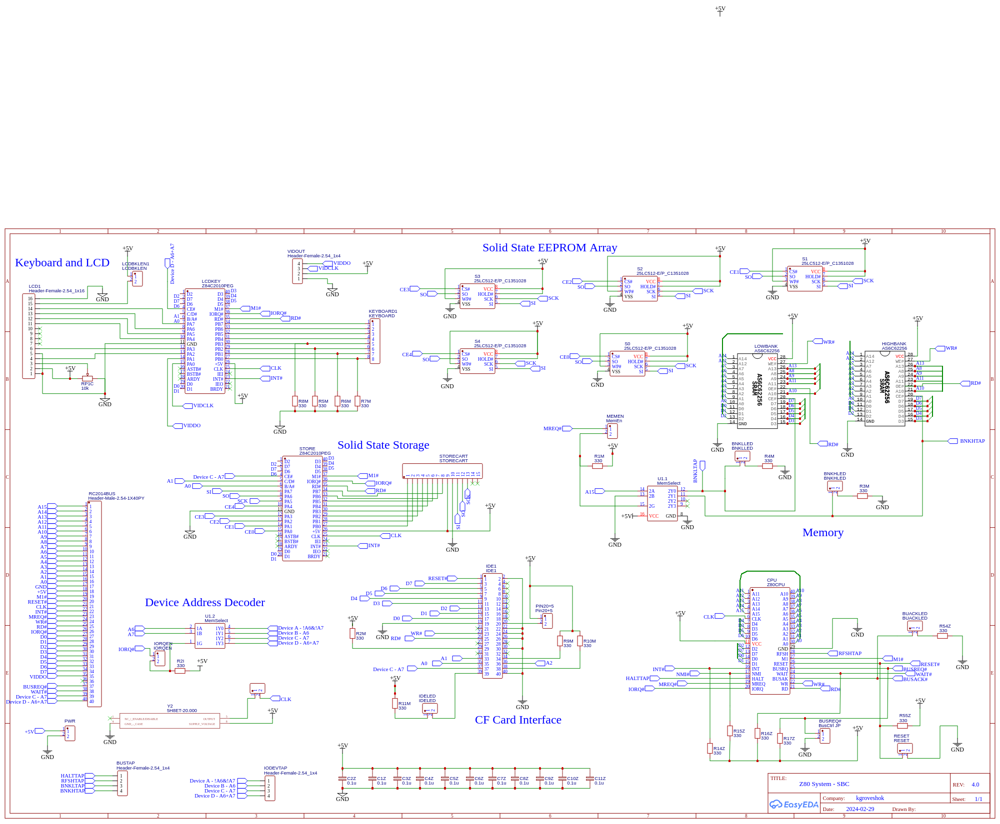
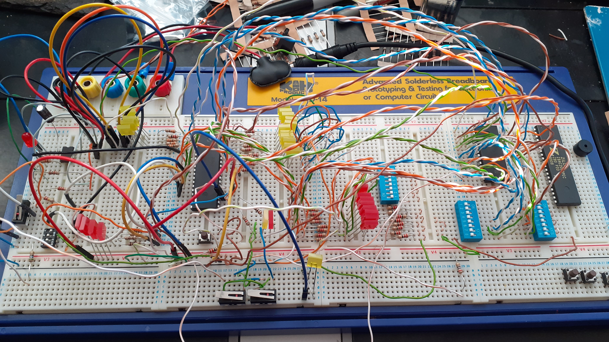
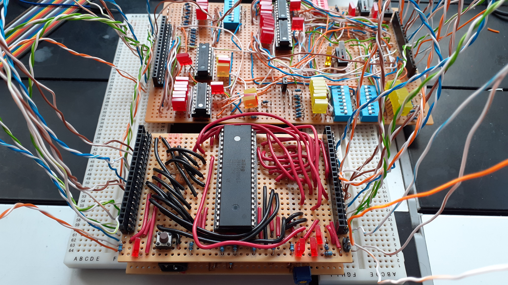
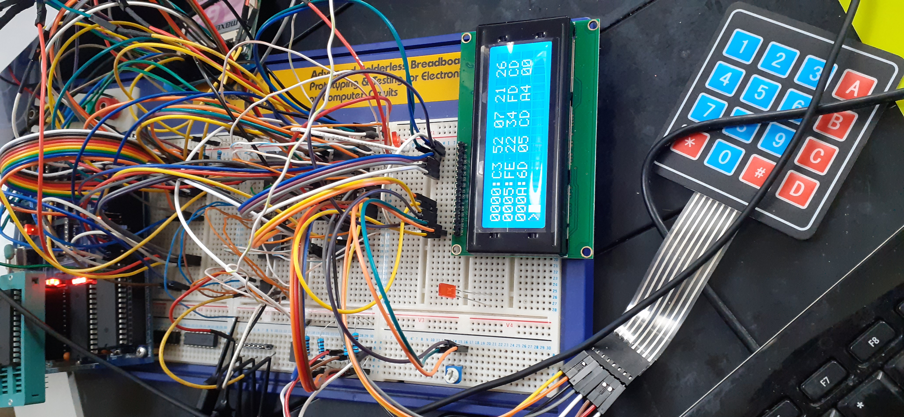
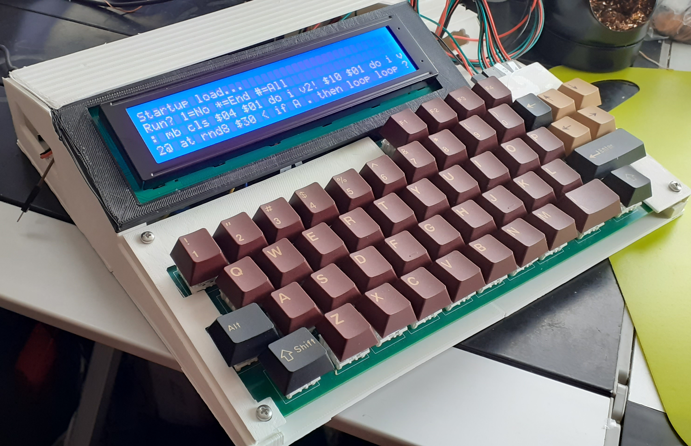

# z80-homebrew
Z80 Home Brew Micro-computer Project
------------------------------------

Having watched so many retro computing videos on YouTube I thought I would relive some of my youth
by building something simple. I remember the old electronic magazines of the 1980's which 
had plenty of simple programmable computing devices to make at home.  Always wanted one. Now I
will do it - only a few decades behind :-)

6502 vs Z80
-----------

My first home computer was a Vic20. Not long after having that in my grubby mitts I was writing
6502 machine code, hand assembling as we all did back then. Later I moved onto an Amstrad CPC464
and dived into Z80 which I then took to the Amstrad PCW 512.

Looking around at parts I found it hard to locate any good 6502 parts and with the vast
Z80 community and lots of great material to dust off my rusty electronics skills I chose that.

Therefore this project, is Z80 based. Turns out that is a good choice as the arch is very simple
with a load of great chips that tie closely together. Makes for an easier life.

Current Specification/Feature Set
---------------------------------

* Z80 4/8MHz
* 32K ROM
* 32K RAM
* PIO 1: Port A & B - Controlling LCD and keyboard:
   - Mini: 20x4 LCD and 4x4 matrix keypad 
   - Mega: 20x4 or 40x4 LCD and 50 key matrix keyboard
* PIO 2: Port A - Persistent storage via Microchip serial EEPROMs. 
   - Max 320K on board (5 x 64k). Currently set for 32k x 5. 
   - Uses own file system with max file size of 16k 
   - 5 banks of independant storage each with own bank label
* PIO 2: Port B - Exposed 8 bit bus and SPI bus. Used for more storage (512k/1024k), SPI devices or digital I/o
* Auto startup scripts/demos built into ROM
* Exposed RC2014 connector
* Digital video out (TODO)
* Built-in address decoder for four devices (2 used above)
* Sound chip (TODO)
* External cart support via PIO 2 Port B. Adding support for:
   - Real time clock (TODO)
   - Extra storage via SD and/or Microchip serial EEPROMS  (TODO)
   - RP Pico using SPI for extra features such as wifi network support
   - GPIO on the 8 pins (TODO) and independant control use of SPI bus

* Hardware abstraction layers to allow for common entry points and drivers for different keyboards, screens, etc
* Multiple selectable frame buffer support (currently three)
* Built-in Forth OS (inspired by Jupiter Ace). Language defintion and progress etc in 
* Built-in full monitor for break points at all key points.
* Using my own very simple malloc/free routinues or can switch to DK88 project version with defines
* 3d printed case designs in 'case' directory.
* To aid in board development and speed up the change and test cycle I've now added support for running on the wonderful Steven Cousin's SC114 board. This is quicker than having to remove the EEPROM (even in a zif socket), burn it and put it back.
* Added CP/M support

Progress
--------

Check the DEV-DIARY.md for progress and what I learnt - spoiler, it is alot!

Stage 1.x was very very basic

Stage 2.x got us to strip board in varying degrees of success

Stage 3.x with a propper PCB things are much more stable (and faster clock freq)...

Stage 4.x a useable machine now with many expandable features.

Current Forth word list in WORD-LIST.md

Parts
-----

At each stage I will document and attach the schematics for mostly for my own reference should things go wrong.

References
----------

I found so much great advice and inspiration around the net here are some of those that made the most
impact (in no particular order):

* [https://maker.pro/pic/projects/z80-computer-project-part-1-the-cpu]
* [https://www.electromaker.io/blog/article/z80-computer-memory]
* [https://www.youtube.com/watch?v=yR566HNj0ao]
* [https://bread80.com/category/couch-to-64k/]
* [https://maggi9295.github.io/projects/z80computer/z80computer.html]
* [http://www.breakintoprogram.co.uk/projects/homebrew-z80/homebrew-z80-computer-part-1]
* [https://incoherency.co.uk/blog/stories/rc2014-frontpanel.html]
* [https://www.instructables.com/An-Easy-to-Build-Real-Homemade-Computer-Z80-MBC2/]
* [https://sites.google.com/view/erics-projects/z-80-projects-page/z-80-pio-ps2-keyboard-interface]
* [http://www.cpuville.com/Projects/Standalone-Z80-computer/Standalone-Z80-home.html]
* [http://www.blunk-electronic.de/train-z/]
* [http://www.friendlywire.com/tutorials/pic-flash/]
* [http://www.waveguide.se/?article=programming-pics-using-the-pickit2-and-pk2cmd]
* [https://microcontrollerslab.com/74hc595-shift-register-interfacing-pic-microcontroller/]
* [https://www.electroschematics.com/multiple-shift-registers-arduino-part-1/]
* [https://z80project.wordpress.com/2015/07/06/z80-8-bit-compact-flash-card-interface-part-1/]
* [https://ciernioo.wordpress.com/2015/02/10/compact-flash-8255-interface-card/]
* [http://www.luke.maurits.id.au/projects/computers/lm512/]
* [https://github.com/monsonite/MINT]
* [https://github.com/antbern/z80-monitor]
* [https://github.com/fiskabollen/z80Monitor]
* [https://github.com/chapmajs/glitchworks_monitor]
* [http://ve7it.cowlug.org/cpm-monitor.html]
* [https://www.instructables.com/Z80-Monitor-Type-Operating-System-and-SBC/]
* [http://www.vaxman.de/projects/tiny_z80/]
* [https://smallcomputercentral.com/]
* [https://rc2014.co.uk/]

