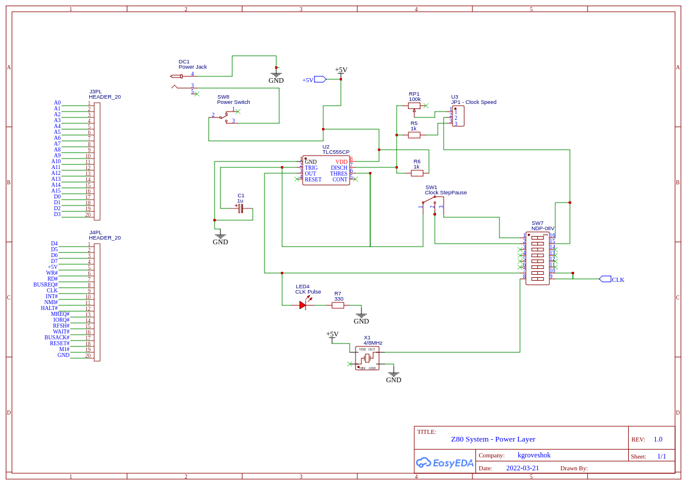

# z80-homebrew
Z80 Home Brew Micro-computer Project
------------------------------------

Having watched so many retro computing videos on YouTube I thought I would relive some of my youth
by building something simple. I remember the old electronic magazines of the 1980's which 
had plenty of simple programmable computing devices to make at home.  Always wanted one. Now I
will do it - only a few decades behind :-)

6502 vs Z80
-----------

My first home computer was a Vic20. Not long after having that in my grubby mitts I was writing
6502 machine code, hand assembling as we all did back then. Later I moved onto an Amstrad CPC464
and dived into Z80 which I then took to the Amstrad PCW 512.

Looking around at parts I found it hard to locate any good 6502 parts and with the vast
Z80 community and lots of great material to dust off my rusty electronics skills I chose that.

Therefore this project, is Z80 based. Turns out that is a good choice as the arch is very simple
with a load of great chips that tie closely together. Makes for an easier life.

Stage 1.0 DONE
--------------

Create a basic breadboard circuit with CPU, clock (for now 555 so I can watch it do things) and RAM.

The CPU is executing whatever random code is in the RAM at start up. Looks pretty with the flashing lights.

See this stage at []

Stage 1.5 DONE
--------------

Resolve the issue I have in manual bit bashing machine code into RAM.

Now fixed in []

Stage 2.0 DONE
--------------

Now I have the sequence to program RAM by hand, speed it. Because I don't have an (E)EPROM 
and programmer I will put a PIC to act as a bootstrap loader at Z80 startup and bit bash a simple 
monitor program into RAM which I can then use to load further code.

First part will be to load the same simple program as used in the the Stage 1.5 test. Once that
electronics is working I can then write larger programs to boot strap which will be where Stage 3.0 
comes in...

Testing shift register... []

Testing shift reg sequence []

Ready to boot strap! []

Another go which does'nt quite work... []... Turns out 
that powering down mid shift register loading fixes it. Will do a better fix with the 
coding on the PIC :-)

Stage 2.5 (DONE)
---------------

The breadboard is becoming quite full, and with the next stage focusing on RS232 where timing is 
important, I think it might be a good idea to finish off the low speed parts first, then
moving as much as I can off of the breadboard to strip board for the space and more stable 
circuit at speed.

In this stage then I want to perhaps add a second 32k RAM chip as the high address bit wire is
currently unconnected. That will then provide a full 64k RAM, as well as the prospect that I
could swap out either RAM and replace with a ROM further down the line. 

I will also obviously add a couple of NAND gates to switch between them. I may also future
proof the setup and consider tapping another address line and splitting the top half into 
smaller sections so that I can slip in external device memory maps. That will depend on the
requirements for the DART, SIO, PIO chips next. Of course moving to strip board using the
stacking method I'm considering means that if I need to change page addressing, I will only
need to swap out the card(s) affected and not the whole board. Bonus!

To do this I *REALLY* need to document the board! :-) I will be using maybe Eagle or easyEDA for 
the main schematic and then ancient VeeCAD for the strip board layout.

Here we go, first draft. Not pretty as a number of things I need to clean up and be consistent
about. But you should get the gist of it I hope. Also as far as the address decoder I don't have
the chip that I found would make life easier so I may just sling in a PIC (yeah I know over kill)
which can be adjusted in light of any requirements for the next stage. In the end I will of
course replace with a fixed device when I know what is going on. This is a work in progress
after all and not a finished project!

PDF versions can be found in the stage2.0 directory too.

Stage 2.5 (NOW)
---------------

Well that week was painful. Have to say easyEDA is not ideal for doing strip board layouts, lack of 
random wire routing prevented all the traces being laid. So in the diagrams any feint blue lines
and red ones are wires that need to be routed over the board surface. Horizontal blue lines are stripboard
tracks. Also some passives (resistors and caps), all LEDs and three diodes take up a lot of room and in 
this easyEDA don't allow for adjusting the leg positions which really helps with stripboard
so some of them on the board layout are 'floating' with I hope some clue about where the should go
if you adjust the legs. The white blocks are track cuts. All looking from front side of the board.

I would say that the board layout gives approx position for the bits and some of the key connections.
This should be enough to help wire it up. 

The multilayer idea has been scalled back a bit to keep part costs down as board and more so the
header strips are a little expensive for some reason:

Hopefully will begin assembly soon. I will take loads of pictures of my protoytype too as
that will help in checking my wiring.

NOTE: After I began to solder things up I noticed a number of problems on the board. I've 
updated the details above on this schematic:

Most important is it won't all fit so have had to move things around a little. 
Another is that a front panel switch previously said MBUSREQ# but that should actually 
go to MREQ#.

Further problems were also found in less than ideal arrangement of pin outs for the PIC.
I've therefore rearranged the allocation and this will affect the coding of the PIC.

Shift Reg DS now on PIC pin 7, SHCP on PIC pin 12 and SPCP on PIC pin 11. PIC pin 6 is now MREQ#,
PIC pin 12 now RESET#, PIC pin 13 now BUSREQ# and PIC pin 10 is WR#. That resulted in one spare LED
and no LED for the DS pulse.

I would then advise not following my stripboard layout and use it as a guide as to rough locations.
The switches in the top right were way too tight and coupled with my poor soldering skills 
(improving after all this though) it forced me to relocate one to the middle of the board which is now
the MREQ#.

Photos of construction below of the front panel without the PIC as that was being reflashed with 
changes for the new pin layout:
 

The red four switch DIP switch has so far two features active:

* 1 - Enables power to the switches when in front panel programming mode - I could really do with
replacing the manual switch with a transitior which activates the power when the BUSACK# line goes
low. 

* 2 - Powers on/off the PIC

* 3 - Not yet connected, enables direction of the PIC clock to the CLK pin as yet another clock source.

* 4 - Not connected.

Next will be the main CPU construction now I know the front panel is working as that is
the most complex of the wiring - really tested my soldering skills!

More mess.... Halfway wiring up the main board discovered I've made some mistakes in the
reverse engineering of my bread board prototype. Going to have to redraw and work out
how to get around my mistakes with what I've already wired. Drat.

Updated main board with the fixes for the wrong LED taps etc:

Both boards now built, however there is a slight bug in the main board. I suspect I have either
missed a track cut or put a wire in the wrong hole. I will have to track that down I suppose!

There still appears to be a problem. The BUSACK LED is still flashing, in fact many of the other
LEDs are flashing in sync with the clock. I suspect something either power related, or there is
a problem still with BUSREQ line and a constant on and off of BUSREQ. I can't see any solder 
bridges and continuty of the lines work out right. 

What I think I will do and this is very annoying is to redesign for a less dense set of boards,
just have say CPU is on one board, clock on another, memory on another. That way I can break
down the issue and hopefully reduce the amount of interference across tracks.

....

I've now rebuilt the clock and CPU boards. Having tested them against the breadboard prototype
and the initial stripboard all appears fine. Perhaps I didn't have a problem???

Anyway now continuing with the memory board build and will then check that. 

Here is a side-by-side setup of the two new smaller boards stacked (timer on the bottom and CPU
on top), along with the very definately working original 'front panel' board so I can watch 
the address lines ticking up the PC location and proving things are working.

Been pretty delayed lately but finished off the memory board:

Have discovered the problem with this new board. The BUSREQ# line is floating and/or not tied right (perhaps even got this pin and BUSAQ# confused) which is causing the CPU to give up the bus and then recover - hence the flashing.

Stage 3.0
---------

Rig up the Z80 DART, SIO or PIO chip to add RS232 support and then program the the boot loader 
with a monitor program and remote program load function. Perhaps too expose some I/O interface
so I can have some future expansion/control features like a Pi.

At this stage I will have serial terminal working and would therefore be a functional computer to
some extent.

Thinking about features for the boot loader/monitor that the PIC will bitbash into RAM:

* Hex dump memory to check things have loaded OK
* Change memory locations to manually load data or fix something if needed
* Set program counter and run 
* XModem/ASCII load of a hex file, or perhaps better still just raw binary load direct into memory
* May be add the monitor to NMI to break into control should things be broken
* Configure various properties of the system and have them saved to PIC flash??? Can't really though
  as the pic pins are one way so essentially it can't be seen by the Z80. This was a design choice.
* When SD or CF card support is added then have some control over loading/saving etc
* Have decided that the monitor will actually function as the main 'OS' simliar to the BASIC's of old
  and it will be a Forth implentation so I can have a good compact and simple language at hand for
  programming and hardware control.

Stage 4.0
---------

Add some external interfaces to make it do other things would be useful. Perhaps even to drive a
small LCD screen like those old Sharp handhend computers I remember. Would also need to add keypad
support of somekind which then makes it a self contained computer. Would be cool if I can then 
place in a suitable case and have battery support.

I know not quite retro enough but a small Rpi that can grab bus and read from 
a screen memory mapped area and sling out on HDMI? Obivously would be nice
to replace with a proper composite out if I ever get that but that is
stretching my skills and have no knowledge (yet) of that tech.

Where to go from here?
----------------------

The DART chip provides more than one serial interface and considering I bought enough parts for 
another Z80 system perhaps I could build some kind of basic networking stack? That would be fun!

Lots of things... Keyboards, screens, SD cards, general interfaces....

Parts
-----

At each stage I will document and attach the schematics for mostly for my own reference should things go wrong.

Final Construction
------------------

I think what would be good is if I at various stages of complete circuit put those working bits down on to
their own strip board (for now) and have the sections stackable. That would help in replacement of parts
and in developing new bits. For example:

* Layer 1 - Power supply and clock selection
* Layer 2 - CPU
* Layer 3 - Memory
# Layer 4 - Boot strap PIC
* Layer 5 - Serial and other interfaces (CF card?)
* Layer 6 - Control Panel (so I could remove the flashy lights and only attach for debug)
* Layer 7 - LCD and keypad

All a bit like the RC2014 but not :-)

References
----------

I found so much great advice and inspiration around the net here are some of those that made the most
impact (in no particular order):

* [https://maker.pro/pic/projects/z80-computer-project-part-1-the-cpu]
* [https://www.electromaker.io/blog/article/z80-computer-memory]
* [https://www.youtube.com/watch?v=yR566HNj0ao]
* [https://bread80.com/category/couch-to-64k/]
* [https://maggi9295.github.io/projects/z80computer/z80computer.html]
* [http://www.breakintoprogram.co.uk/projects/homebrew-z80/homebrew-z80-computer-part-1]
* [https://incoherency.co.uk/blog/stories/rc2014-frontpanel.html]
* [https://www.instructables.com/An-Easy-to-Build-Real-Homemade-Computer-Z80-MBC2/]
* [https://sites.google.com/view/erics-projects/z-80-projects-page/z-80-pio-ps2-keyboard-interface]
* [http://www.cpuville.com/Projects/Standalone-Z80-computer/Standalone-Z80-home.html]
* [http://www.blunk-electronic.de/train-z/]
* [http://www.friendlywire.com/tutorials/pic-flash/]
* [http://www.waveguide.se/?article=programming-pics-using-the-pickit2-and-pk2cmd]
* [https://microcontrollerslab.com/74hc595-shift-register-interfacing-pic-microcontroller/]
* [https://www.electroschematics.com/multiple-shift-registers-arduino-part-1/]
* [https://z80project.wordpress.com/2015/07/06/z80-8-bit-compact-flash-card-interface-part-1/]
* [https://ciernioo.wordpress.com/2015/02/10/compact-flash-8255-interface-card/]
* [http://www.luke.maurits.id.au/projects/computers/lm512/]
* [https://github.com/monsonite/MINT]
* [https://github.com/antbern/z80-monitor]
* [https://github.com/fiskabollen/z80Monitor]
* [https://github.com/chapmajs/glitchworks_monitor]
* [http://ve7it.cowlug.org/cpm-monitor.html]
* [https://www.instructables.com/Z80-Monitor-Type-Operating-System-and-SBC/]
* ]http://www.vaxman.de/projects/tiny_z80/]

